# DartERP (DERP)

A lightweight manufacturing ERP desktop application built with C#, .NET 8, and WinForms — internal tooling for a fictional firearms manufacturing company, DERP Manufacturing.


## Overview

DartERP is a manufacturing ERP covering the core loop of a small manufacturer: customers and vendors, a product catalog and inventory, purchase orders, production (work orders), serialized inventory for finished goods, and quality control inspections. It's built as a realistic internal business application — WinForms desktop client, layered application/service code, Entity Framework Core over SQL Server — the kind of stack a lot of manufacturing and distribution companies still run on day to day.

The firearms-manufacturing setting is business context only. Products are ERP records (SKU, cost, price, quantity) with no engineering, machining, or ballistic data anywhere in the system.

## Why I Built It

I work professionally with ERP implementations — SQL Server, REST APIs, third-party integrations, data migration, and day-to-day business workflows — from the configuration and consulting side. I wanted to build a representative ERP application from the *development* side: designing the schema, writing the business rules, and building the UI that consultants like me configure and troubleshoot in the field.

### Demo Login

```
Username: admin
Password: Password123!
```

Two other seeded accounts (`jmorales`, `dcarter`) use the same password if you want to see a different name/role in the header. This is fictional demo data for a portfolio project — real deployments would obviously never document a shared password like this.

## Feature Tour

Every screen in the sidebar, in order, with what it does, the popups it opens, and the specific pieces of the stack behind it.

---

### Sign In & Accounts

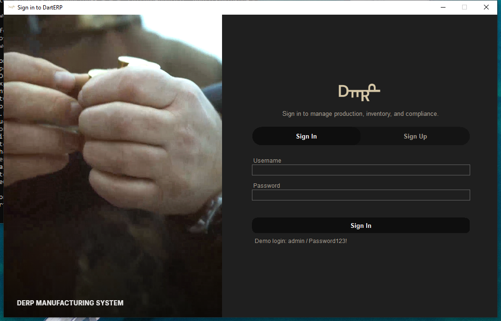

The gate in front of the whole app — nothing renders until you're authenticated. Sign In and Sign Up share one card with a tab switch; the left panel is a looping video background rendered through WebView2, with a static branded panel as a fallback if the WebView2 runtime isn't installed. Once signed in, the header's avatar opens a menu into your profile, a lock screen, or logout.

**Functionality:**
- Sign in / sign up with a username and password
- Header profile menu → Profile, Lock, Log Out
- Profile dialog: edit display name, role, phone, email, upload a picture, change password
- Lock screen re-prompts for the current user's password without ending the session (session stays alive — unlike Log Out, which tears it down and returns to a fresh Sign In)

**Popups:**

| 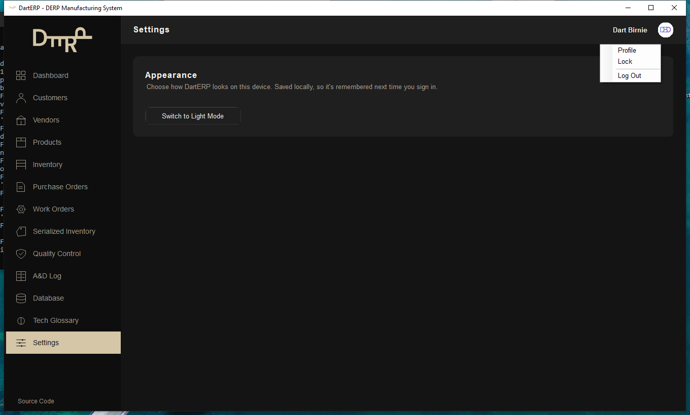 | 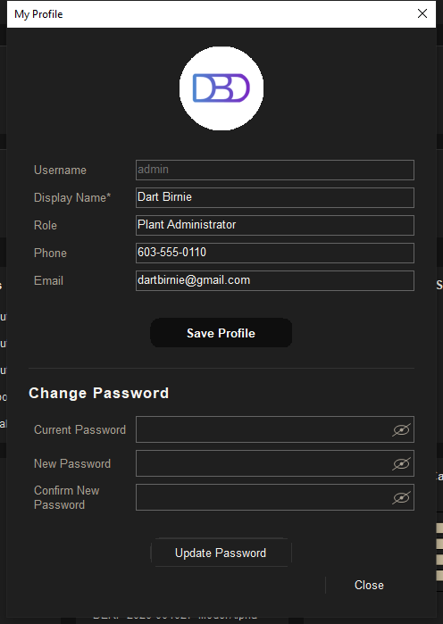 |
|---|---|
| Profile menu | My Profile |

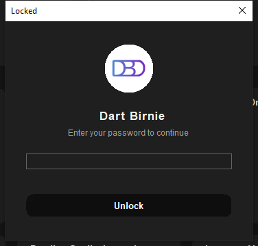
*Lock screen*

**Tech used:** WebView2 (video background, with a static-panel fallback), PBKDF2 password hashing via `Rfc2898DeriveBytes` (salted, one-way, in `DartERP.Core`), `CurrentUserContext` singleton for the signed-in session, `MainForm`/`LoginForm` registered `Transient` in DI so logging out gets a completely fresh window, a `Program.cs` sign-in loop driving the whole thing.

---

### Dashboard


Landing screen after sign-in: a snapshot of the whole business — what's active, what's low, what's overdue — plus two live charts.

**Functionality:**
- Six KPI cards: active customers/vendors, open purchase/work orders, inventory value, units in production
- "Recent Purchase Orders," "Products Below Reorder Level," "Work Orders Due Soon," and "Pending Quality Inspections" attention panels
- **Purchase Orders by Status** — donut chart
- **Inventory Value by Category** — horizontal bar chart

**Tech used:** Two Syncfusion `ChartControl` instances, styled by hand to the app's tan-and-black palette rather than a stock Syncfusion theme. `DashboardService.GetSummaryAsync` fires twelve repository calls (including the two `GroupBy` aggregations behind the charts) concurrently via `Task.WhenAll` — safe because every repository call opens its own short-lived `DbContext`. A shared `DashboardCard` base class supplies the title-plus-rounded-card chrome for every card and chart alike.

---

### Customers


Company and contact records for who buys finished product.

**Functionality:**
- Search by company, contact, or customer number
- "Active only" filter toggle
- Create, edit, soft-deactivate (deactivated customers are hidden by default, not deleted)
- Export CSV of exactly what's on screen

**Popups:**

| 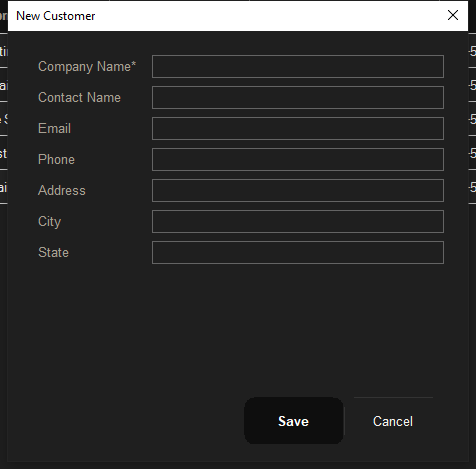 | 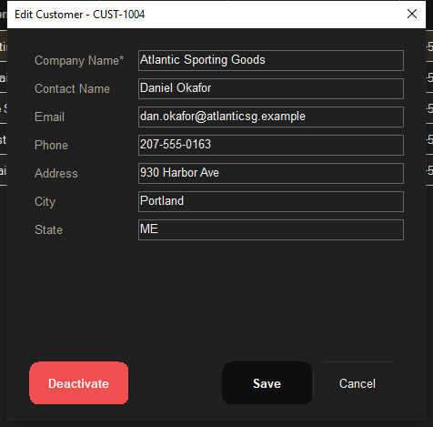 |
|---|---|
| New Customer | Edit Customer (with Deactivate) |

**Tech used:** Syncfusion `SfDataGrid`, `CustomerService` validation in `DartERP.Application`, `ICustomerRepository` over `IDbContextFactory<DartErpDbContext>`.

---

### Vendors


Suppliers you buy raw materials, components, and services from.

**Functionality:**
- Search by company, contact, or vendor number
- Create, edit, soft-deactivate, and a Vendor Type field (Raw Materials, Components, Packaging, Services)
- Inactive vendors are excluded as options on new purchase orders
- Export CSV

**Popups:**

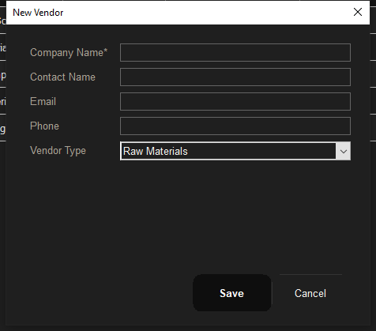
*New Vendor*

**Tech used:** Same `SfDataGrid` + service/repository pattern as Customers. The Vendor Type `ComboBox` is populated on the form's `Load` event rather than in the constructor — binding it earlier fails silently because the native window handle doesn't exist yet (see [docs/ARCHITECTURE.md](docs/ARCHITECTURE.md) for the full writeup of that gotcha).

---

### Products


The catalog: everything from raw steel stock to finished, serialized firearms.

**Functionality:**
- Search by SKU or product name
- Create, edit, soft-deactivate
- Unique-SKU enforcement
- Category (Raw Material, Component, Packaging, Finished Product), unit cost, sale price, quantity on hand, and a Serialized flag that determines whether the product tracks individual serial numbers
- Export CSV

**Popups:**

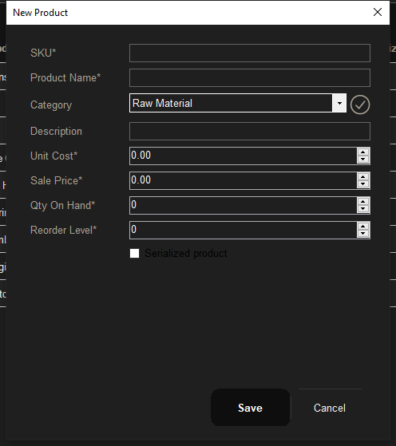
*New Product*

**Tech used:** `ProductService` enforces the unique-SKU rule and the serialized-product constraints that Serialized Inventory and Work Orders both depend on later.

---

### Inventory


A read-focused rollup over Products, built for "what do we have and what's running low," not record editing.

**Functionality:**
- Four summary cards: total inventory value, active products, serialized products, products below reorder level
- Per-product table: quantity on hand, reorder level, inventory value, serialized flag, and a stock status badge (OK / Below Reorder)
- Export CSV

**Tech used:** `SfDataGrid` bound to an aggregation query rather than the raw `Products` table — the same underlying data as the Products screen, reshaped for a stock-health view.

---

### Purchase Orders


Multi-line orders to vendors, with a full status workflow and an audit trail of every status change.

**Functionality:**
- Draft → Submitted → Approved → Received/Cancelled workflow
- Multi-line orders with a product picker; line and order totals recalculate live as you edit
- Validation: active vendor required, at least one line before submission, non-negative quantities/costs
- **Status History** panel — who changed the status, from what, to what, and when
- File attachments (invoices, packing slips) with open/remove actions
- Export CSV

**Popups:**

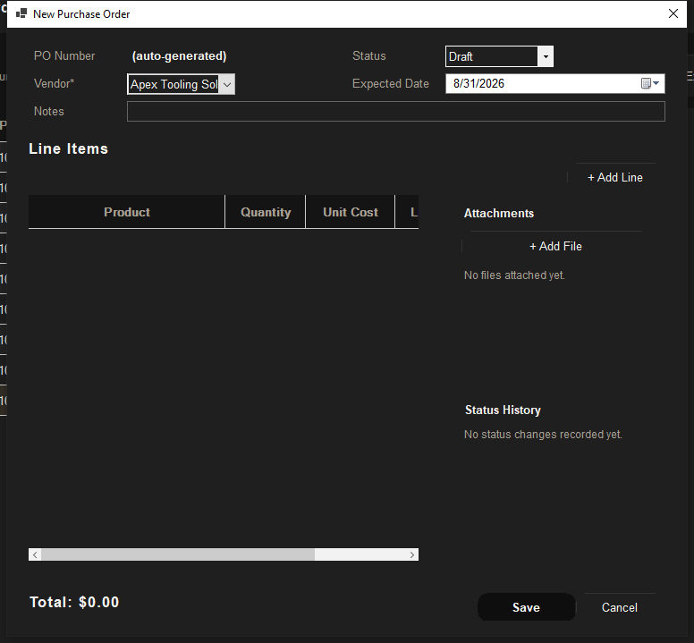
*New Purchase Order — product picker, live totals, attachments, and status history all in one dialog*

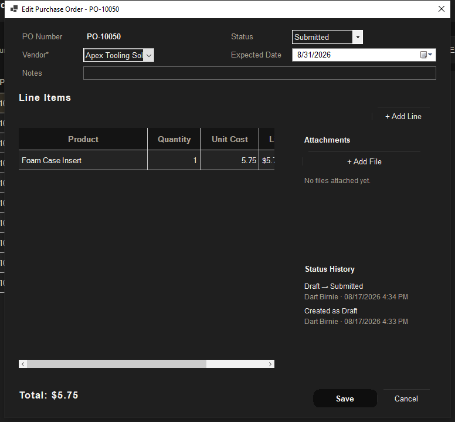
*Edit Purchase Order — status history populated after moving Draft → Submitted through the app (seed data bypasses the service layer, so freshly-seeded orders start with no history until a real status change runs through it)*

**Tech used:** The line grid is a Syncfusion `SfDataGrid` bound to a `BindingList<PurchaseOrderLineRow>` — rows implement `INotifyPropertyChanged` so editing quantity or unit cost recomputes that row's total, and the `BindingList`'s `ListChanged` event recomputes the grand total, with no manual `CellValueChanged` wiring. A `GridComboBoxColumn` auto-fills a default unit cost from the catalog on product selection. `PurchaseOrderService` in `DartERP.Application` owns every validation rule and logs a `PurchaseOrderStatusHistory` row on create and on every actual status change (never on a no-op save) — visible directly at the table level in the [Database Explorer](#database-explorer).

---

### Work Orders


Production orders: turning raw materials and components into a finished product.

**Functionality:**
- Planned → Released → In Production → Quality Control → Completed/Cancelled workflow
- Filter by status
- Same Status History panel as Purchase Orders
- Completed or cancelled work orders are locked against further edits
- Export CSV

**Popups:**

| 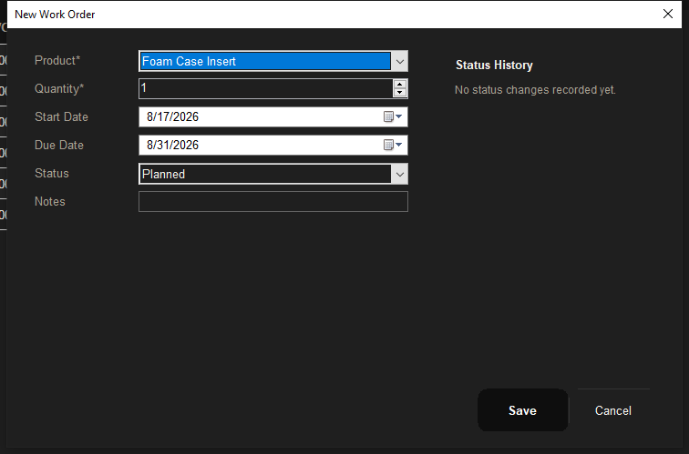 | 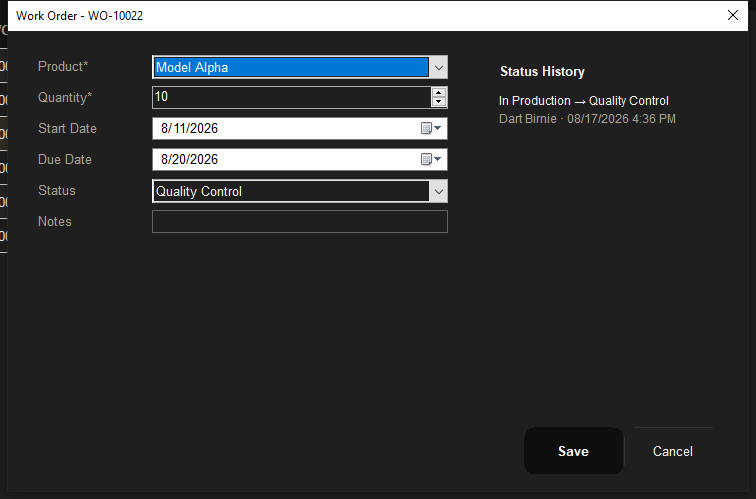 |
|---|---|
| New Work Order | Edit Work Order — status history after In Production → Quality Control |

**Tech used:** `WorkOrderService.IsLocked` blocks edits on Completed/Cancelled orders at the service layer (not just disabled UI controls), so the rule holds even if a screen is bypassed. Same `WorkOrderStatusHistory` audit pattern as Purchase Orders.

---

### Serialized Inventory


Individual, uniquely-numbered units of every serialized finished product, tied back to the work order that produced them.

**Functionality:**
- Search by serial number
- Add a serialized item (only offered for products flagged `Serialized`)
- Status per unit: In Production → In Stock → Shipped
- Export CSV

**Tech used:** `SerializedItemService.CreateAsync` enforces that a serialized item can only be created against a work order whose product is actually serialized — one of the cross-entity rules that lives in the service layer rather than the UI.

---

### Quality Control


Inspection records against serialized items.

**Functionality:**
- All inspections, most recent first
- Pending / Passed / Failed results, inspector, inspection date, notes
- Export CSV

**Popups:**

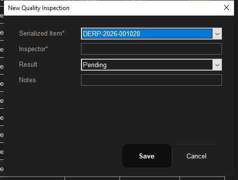
*New Quality Inspection*

**Tech used:** `QualityInspectionService` links each inspection to a `SerializedItem`; the Dashboard's "Pending Quality Inspections" panel reads from the same table.

---

### A&D Log

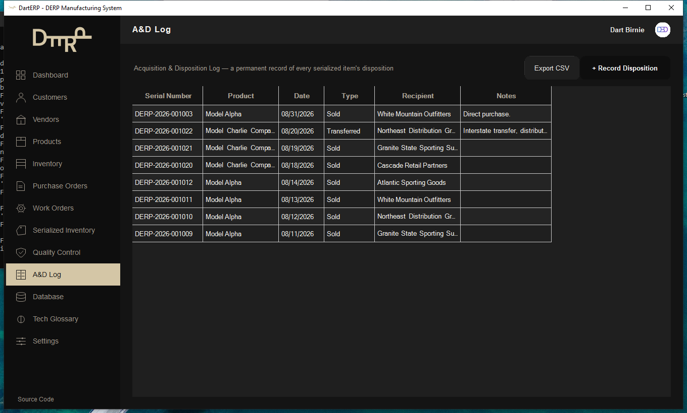

ATF-style Acquisition & Disposition tracking — a permanent record of where every serialized item went and to whom.

**Functionality:**
- Sold / Transferred / Destroyed / Returned disposition types
- Sold and Transferred require a recipient
- Recording a disposition also updates the item's inventory status, so Serialized Inventory and the A&D Log can never disagree with each other
- Export CSV

**Popups:**

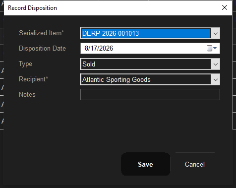
*Record Disposition*

**Tech used:** `DispositionService` writes the `Dispositions` row and updates the linked `SerializedItem` status in the same operation, keeping both records consistent by construction rather than by convention.

---

### Database Explorer

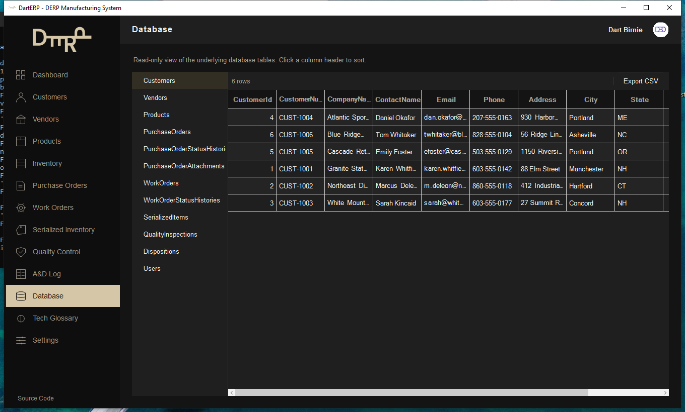

A generic, read-only browser over the actual database tables — sixteen of them, one click away in the sidebar.

**Functionality:**
- Click any table in the left rail to load it
- Click a column header to sort
- Export CSV of the current table

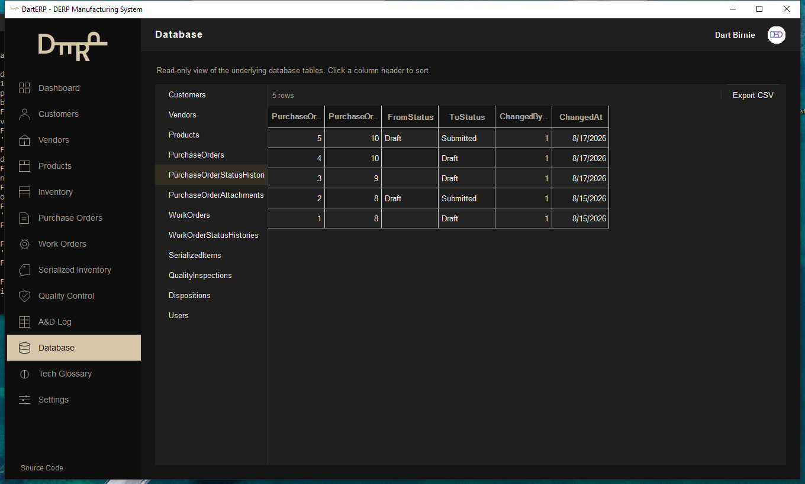
*The `PurchaseOrderStatusHistories` table, showing the Draft → Submitted transition recorded by the Purchase Orders popup above — proof the audit trail actually lands in the database, not just the UI*

**Tech used:** Every other screen in the app hand-curates its columns and goes through the service layer; this one binds straight to each repository's raw `GetAllAsync()` and lets Syncfusion's `SfDataGrid` build columns via reflection (`AutoGenerateColumns=true`), because the point here is showing the real schema, not another polished business view of it. Nav/collection properties are hidden generically by column `ValueType`; header-click sort rebuilds a concretely-typed `List<T>` via reflection, since a plain `List<T>` has no built-in click-to-sort.

---

### Tech Glossary

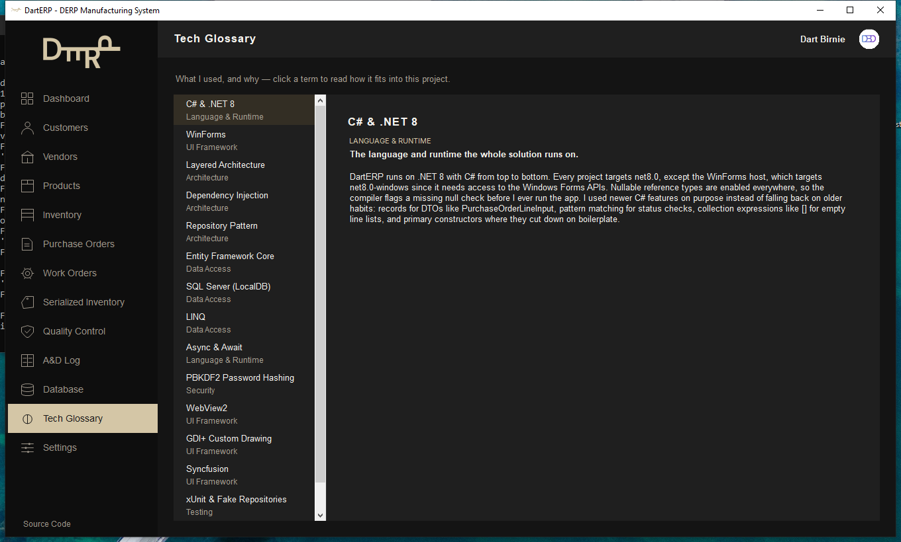

An in-app, first-person write-up of every technology used in DartERP and why — the reasoning behind the build lives in the app itself, not just this README.

**Functionality:**
- Click any term in the left list to read how it fits into this project
- Grouped by Language & Runtime, UI Framework, Architecture, Data Access, Security, Testing
- (Also includes two hand-drawn GDI+ diagrams elsewhere in this section of the app: the layer dependency graph and a request's actual path from the UI down to SQL Server)

**Tech used:** Static content rendered from a plain in-memory list — appropriately, the simplest page in the app.

---

### Settings

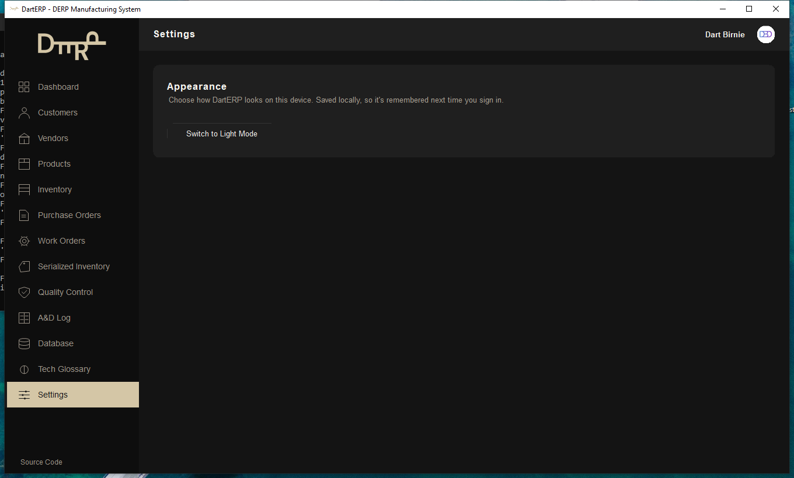

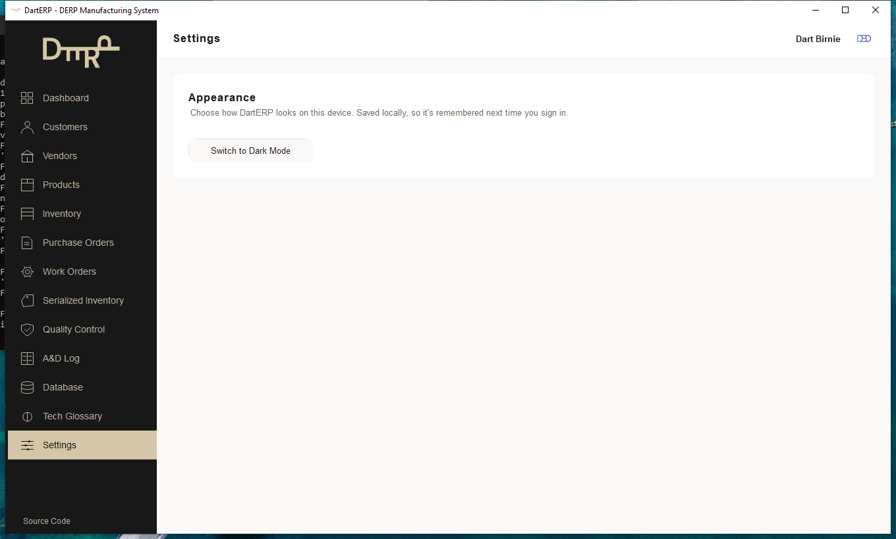
*Live theme toggle — Dark Mode (default) and Light Mode*

**Functionality:**
- Switch between Dark Mode and Light Mode, applied immediately across every open screen
- Preference is saved locally and remembered on next sign-in

**Tech used:** A mutable `Theme` with a `ThemeChanged` event that every screen subscribes to, reusing `MainForm`'s existing rebuild-on-navigate pattern rather than requiring an app restart.

---

## Technology Stack

- C# / .NET 8
- Windows Forms (net8.0-windows)
- Entity Framework Core 8 (SQL Server provider)
- SQL Server LocalDB (development)
- Syncfusion WinForms (`SfDataGrid`, `ChartControl`) — every grid and both dashboard charts, styled by hand to this app's own tan-and-black theme
- WebView2 — the login screen's video background
- Microsoft.Extensions.DependencyInjection
- Microsoft.Extensions.Configuration
- xUnit 2.5

CSV Export is available on every list screen and the Database Explorer — it writes out exactly what's on screen (current search/filter/sort included), reading straight from each row's bound data rather than re-querying.

## Architecture

```
WinForms UI  (DartERP.WinForms)
     |  Forms, Controls, DI composition root (Program.cs)
     v
Application Services  (DartERP.Application)
     |  Business rules, validation
     v
Repositories  (DartERP.Infrastructure)
     |  IDbContextFactory-based data access
     v
Entity Framework Core  (DartErpDbContext)
     v
SQL Server (LocalDB)
```

`DartERP.Core` sits underneath all of it — models, enums, DTOs, and interfaces — and has no project references of its own, so `Application` and `Infrastructure` both depend on it without depending on each other directly.

Repositories use `IDbContextFactory<DartErpDbContext>` rather than a single injected `DbContext`. WinForms apps are long-lived single-process, single-window applications with no natural "request" boundary the way a web app has one per HTTP call — holding one shared `DbContext` for the app's whole lifetime lets its change tracker grow unbounded and risks stale data across screens. Each repository method opens a short-lived context, does its work, and disposes it.

See [docs/ARCHITECTURE.md](docs/ARCHITECTURE.md) for more detail and [docs/DATABASE.md](docs/DATABASE.md) for the schema and entity relationships.

## Database Design

Sixteen tables, including `Customers`, `Vendors`, `Products`, `PurchaseOrders`/`PurchaseOrderLines`/`PurchaseOrderStatusHistories`/`PurchaseOrderAttachments`, `WorkOrders`/`WorkOrderStatusHistories`, `SerializedItems`, `QualityInspections`, `Dispositions`, and `Users`. Unique indexes on `CustomerNumber`, `VendorNumber`, `SKU`, `PurchaseOrderNumber`, `WorkOrderNumber`, `SerialNumber`, and `Username`. Full details and an ERD in [docs/DATABASE.md](docs/DATABASE.md).

## Prerequisites

- [Visual Studio 2022](https://visualstudio.microsoft.com/) (Community or higher) with the **.NET desktop development** workload
- [.NET 8 SDK](https://dotnet.microsoft.com/download/dotnet/8.0)
- **SQL Server Express LocalDB** — installable as an individual component from the Visual Studio Installer, or standalone via the [SQL Server Express installer](https://www.microsoft.com/en-us/sql-server/sql-server-downloads)
- **WebView2 Runtime** — powers the login screen's video background. Ships with Windows 11 and rides along with Edge updates on Windows 10, so most machines already have it; if not, it's a small standalone install from [Microsoft](https://developer.microsoft.com/microsoft-edge/webview2/). The login screen falls back to a static branded panel if it's genuinely unavailable.
- Git

Verify your environment:

```bash
dotnet --list-sdks
sqllocaldb info
```

You should see an `8.0.x` SDK and an `MSSQLLocalDB` instance.

## Getting Started

```bash
git clone <this-repo-url>
cd DartERP
dotnet restore
dotnet build
```

No manual database setup is required — the app applies pending EF Core migrations and seeds realistic demo data automatically on first launch.

The default connection string (in `src/DartERP.WinForms/appsettings.json`) targets LocalDB:

```
Server=(localdb)\MSSQLLocalDB;Database=DartERP;Trusted_Connection=True;TrustServerCertificate=True;
```

## Running DartERP

**Visual Studio:** open `DartERP.sln`, set `DartERP.WinForms` as the startup project, press F5.

**CLI:**

```bash
dotnet run --project src/DartERP.WinForms
```

## Migrations

If you change the model, add a new migration from the repository root:

```bash
dotnet ef migrations add <MigrationName> --project src/DartERP.Infrastructure/DartERP.Infrastructure.csproj --startup-project src/DartERP.Infrastructure/DartERP.Infrastructure.csproj --output-dir Data/Migrations
dotnet ef database update --project src/DartERP.Infrastructure/DartERP.Infrastructure.csproj --startup-project src/DartERP.Infrastructure/DartERP.Infrastructure.csproj
```

(The app also applies migrations automatically at startup, so `database update` is only needed if you want to apply them without launching the app.)

## Testing

```bash
dotnet test tests/DartERP.Tests/DartERP.Tests.csproj
```

44 xUnit tests cover the core business rules: purchase order validation (active vendor, line requirements, non-negative quantities/costs) and total calculations, unique serial number generation and the serialized-product requirement, work order date ordering and locked-status edits, unique SKU enforcement, customer number generation, disposition recording (recipient required for Sold/Transferred, inventory status updates on disposal), password hashing (salted, verifiable, never reversible), account rules (duplicate usernames, wrong-password rejection, inactive accounts can't sign in), status-history logging on Purchase Orders and Work Orders (initial entry on create, one entry per actual status change, no entry on a no-op save), and purchase order attachment metadata (add/remove). Tests run against lightweight in-memory fake repositories rather than a real database.

## Future Improvements

- **Sales Orders** — customer-facing order module mirroring Purchase Orders, cut to keep the core workflow polished within the timeline
- **REST API** — a thin HTTP layer over the Application services, for integration scenarios
- Role-based access control — `Role` on `User` is a display field today (shown on the profile and header), not an enforced permission set; every signed-in user can reach every screen
- Barcode/label printing for serialized inventory
