# DartERP (DERP)

A lightweight manufacturing ERP desktop application built with C#, .NET 8, and WinForms — internal tooling for a fictional firearms manufacturing company, DERP Manufacturing.

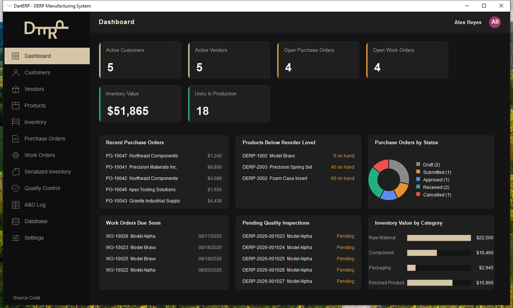

## Overview

DartERP is a manufacturing ERP covering the core loop of a small manufacturer: customers and vendors, a product catalog and inventory, purchase orders, production (work orders), serialized inventory for finished goods, and quality control inspections. It's built as a realistic internal business application — WinForms desktop client, layered application/service code, Entity Framework Core over SQL Server — the kind of stack a lot of manufacturing and distribution companies still run on day to day.

The firearms-manufacturing setting is business context only. Products are ERP records (SKU, cost, price, quantity) with no engineering, machining, or ballistic data anywhere in the system.

## Why I Built It

I work professionally with ERP implementations — SQL Server, REST APIs, third-party integrations, data migration, and day-to-day business workflows — from the configuration and consulting side. I wanted to build a representative ERP application from the *development* side: designing the schema, writing the business rules, and building the UI that consultants like me configure and troubleshoot in the field.

## Features

- **Dashboard** — live KPIs (active customers/vendors, open purchase/work orders, inventory value, units in production), attention-needed panels (recent POs, low-stock products, work orders due soon, pending QC inspections), and two hand-drawn charts (Purchase Orders by Status as a donut, Inventory Value by Category as a bar chart) — no charting library, plain GDI+
- **Customers** — search, create, edit, soft-deactivate
- **Vendors** — search, create, edit, soft-deactivate, vendor type; inactive vendors are excluded from new purchase orders
- **Products & Inventory** — SKU/category/pricing management with unique-SKU enforcement, plus a separate Inventory view (value, low-stock highlighting, serialized vs. non-serialized mix)
- **Purchase Orders** — multi-line orders with a product picker, automatic line and order total calculation, Draft → Submitted → Approved → Received/Cancelled status workflow, and validation (active vendor required, at least one line before submission, non-negative quantities/costs)
- **Work Orders** — production orders against a product with Planned → Released → In Production → Quality Control → Completed/Cancelled status; completed or cancelled orders are locked against further edits
- **Serialized Inventory** — unique serial number generation and tracking for serialized finished goods, tied to the work order that produced them
- **Quality Control** — Pending/Passed/Failed inspections against serialized items
- **A&D Log** — ATF-style Acquisition & Disposition tracking: a permanent record of where every serialized item went (Sold/Transferred/Destroyed/Returned) and to whom, with Sold/Transferred requiring a recipient. Recording a disposition also updates the item's inventory status, so Serialized Inventory and the A&D Log never disagree
- **Authentication & User Accounts** — sign in/sign up on a branded login screen (looping video background via WebView2), PBKDF2-hashed passwords (salted, one-way — never stored in plain text), a profile menu (avatar, display name, role, phone, email, picture upload, change password), a lock screen that re-prompts for a password without ending the session, and a true log-out that returns to a fresh sign-in
- **Database Explorer** — a generic, read-only browser over the actual database tables (nine of them, one click away in the sidebar), sortable by any column. Every other screen in the app hand-curates its columns and goes through the service layer; this one binds straight to each repository's raw `GetAllAsync()` and lets `DataGridView` build columns via reflection, because the point here is showing the real schema, not another polished business view of it

Sales Orders and a REST API were scoped out to keep the core workflow polished within the available time — see [Future Improvements](#future-improvements).

### Demo Login

```
Username: admin
Password: Password123!
```

Two other seeded accounts (`jmorales`, `dcarter`) use the same password if you want to see a different name/role in the header. This is fictional demo data for a portfolio project — real deployments would obviously never document a shared password like this.

## Technology Stack

- C# / .NET 8
- Windows Forms (net8.0-windows)
- Entity Framework Core 8 (SQL Server provider)
- SQL Server LocalDB (development)
- Microsoft.Extensions.DependencyInjection
- Microsoft.Extensions.Configuration
- xUnit 2.5

## Architecture

```
WinForms UI  (DartERP.WinForms)
     |  Forms, Controls, DI composition root (Program.cs)
     v
Application Services  (DartERP.Application)
     |  Business rules, validation
     v
Repositories  (DartERP.Infrastructure)
     |  IDbContextFactory-based data access
     v
Entity Framework Core  (DartErpDbContext)
     v
SQL Server (LocalDB)
```

`DartERP.Core` sits underneath all of it — models, enums, DTOs, and interfaces — and has no project references of its own, so `Application` and `Infrastructure` both depend on it without depending on each other directly.

Repositories use `IDbContextFactory<DartErpDbContext>` rather than a single injected `DbContext`. WinForms apps are long-lived single-process, single-window applications with no natural "request" boundary the way a web app has one per HTTP call — holding one shared `DbContext` for the app's whole lifetime lets its change tracker grow unbounded and risks stale data across screens. Each repository method opens a short-lived context, does its work, and disposes it.

See [docs/ARCHITECTURE.md](docs/ARCHITECTURE.md) for more detail and [docs/DATABASE.md](docs/DATABASE.md) for the schema and entity relationships.

## Screenshots

| | |
|---|---|
| 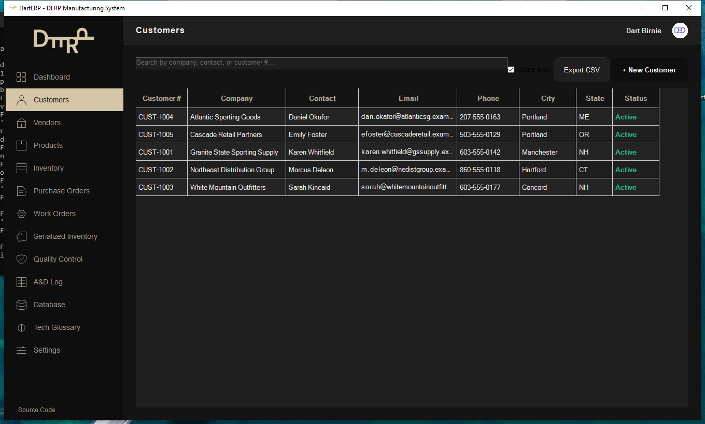 | 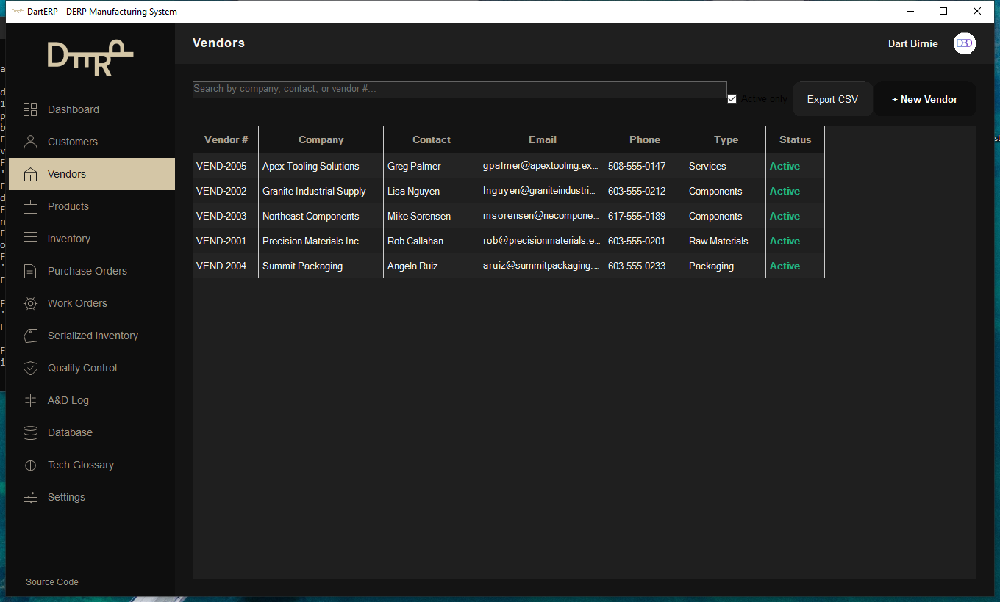 |
| 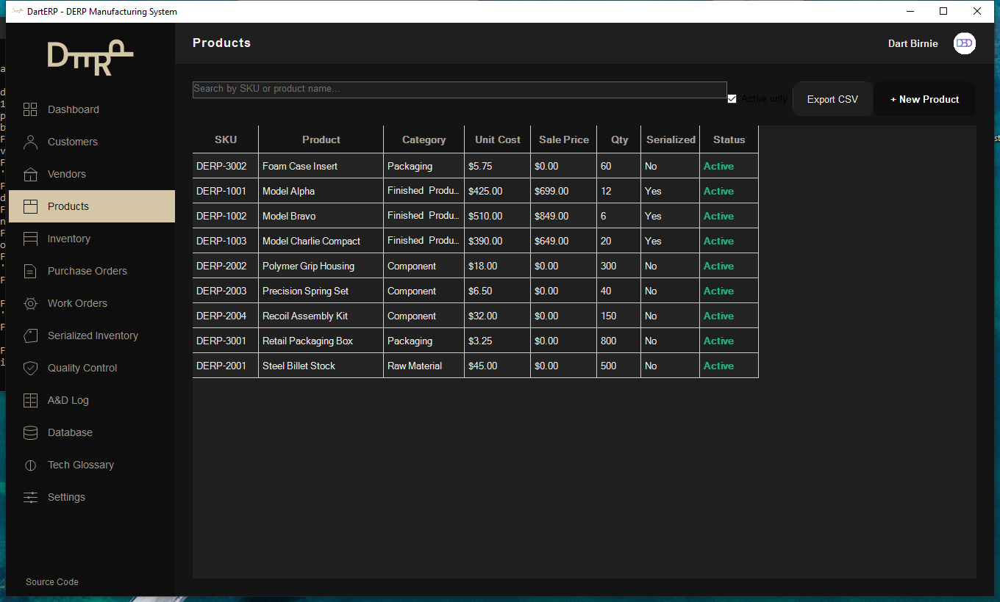 | 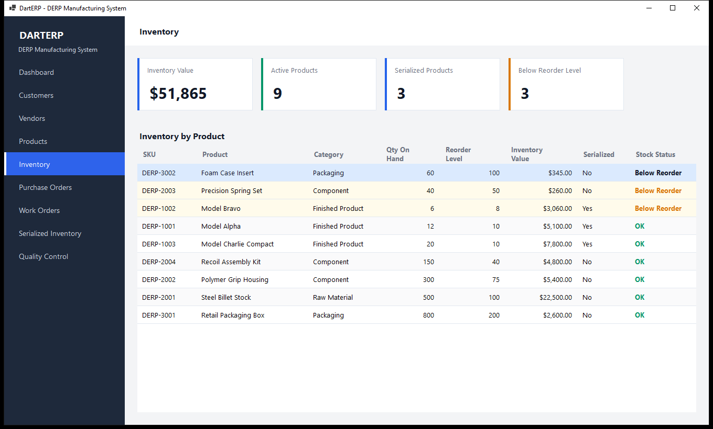 |
| 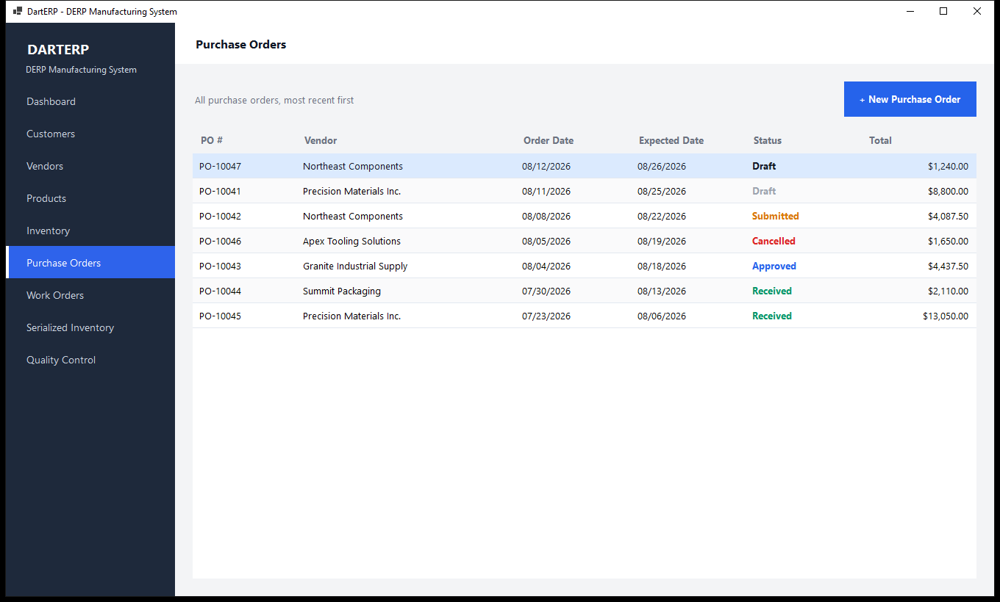 | 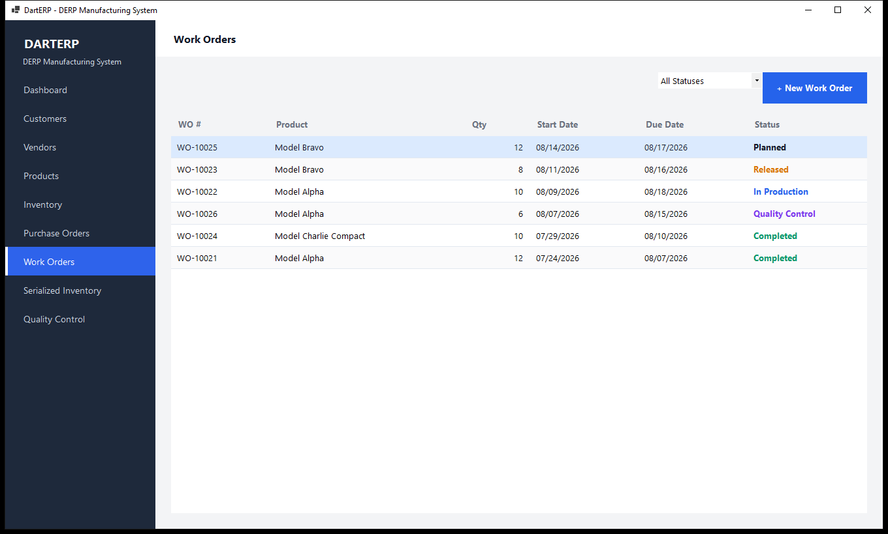 |
| 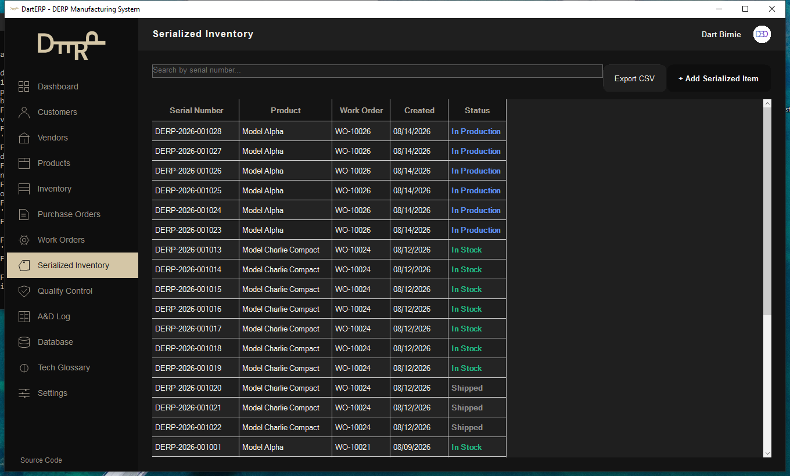 | 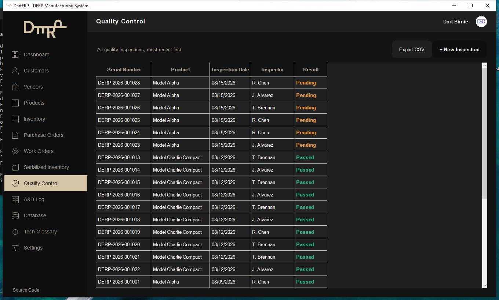 |
| 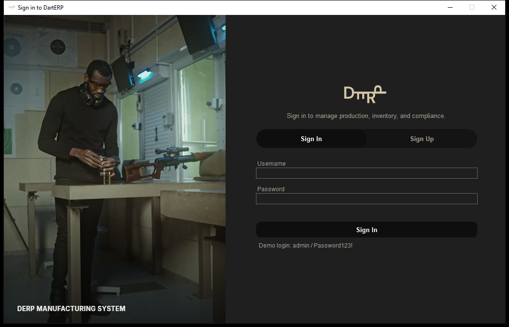 | 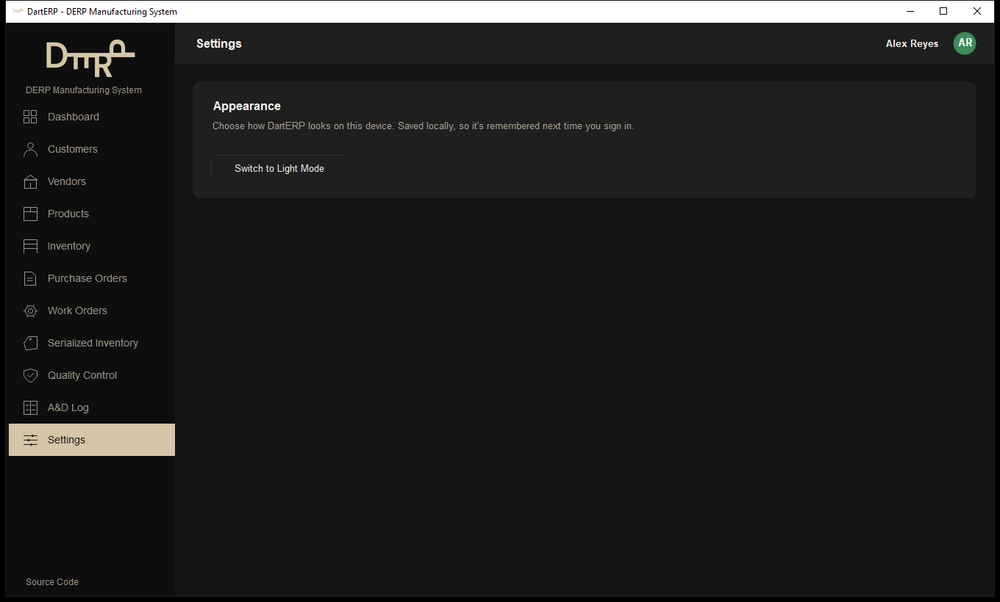 |
| 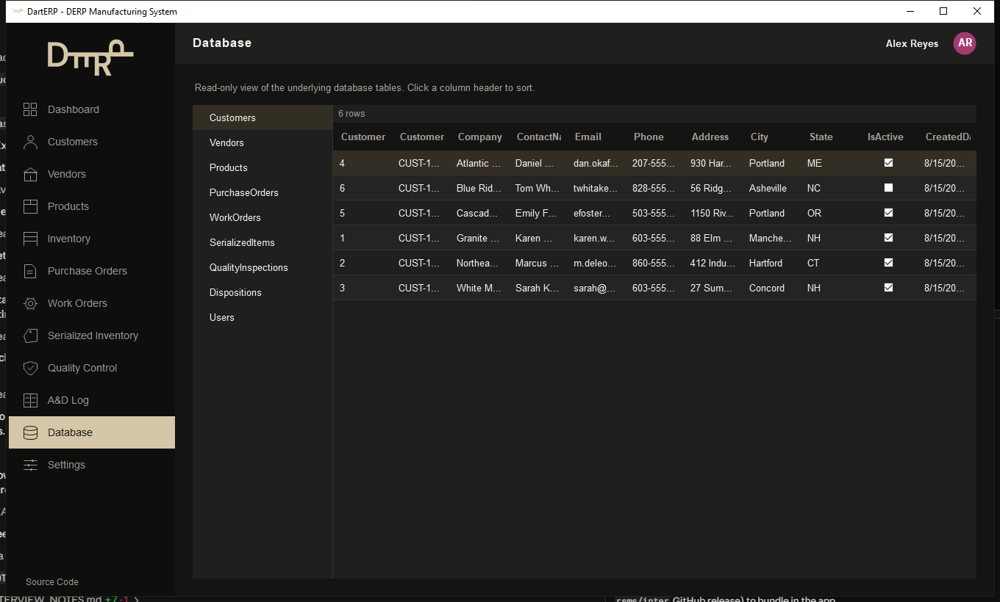 | |

## Database Design

Ten tables: `Customers`, `Vendors`, `Products`, `PurchaseOrders`/`PurchaseOrderLines`, `WorkOrders`, `SerializedItems`, `QualityInspections`, `Dispositions`, `Users`. Unique indexes on `CustomerNumber`, `VendorNumber`, `SKU`, `PurchaseOrderNumber`, `WorkOrderNumber`, `SerialNumber`, and `Username`. Full details and an ERD in [docs/DATABASE.md](docs/DATABASE.md).

## Prerequisites

- [Visual Studio 2022](https://visualstudio.microsoft.com/) (Community or higher) with the **.NET desktop development** workload
- [.NET 8 SDK](https://dotnet.microsoft.com/download/dotnet/8.0)
- **SQL Server Express LocalDB** — installable as an individual component from the Visual Studio Installer, or standalone via the [SQL Server Express installer](https://www.microsoft.com/en-us/sql-server/sql-server-downloads)
- **WebView2 Runtime** — powers the login screen's video background. Ships with Windows 11 and rides along with Edge updates on Windows 10, so most machines already have it; if not, it's a small standalone install from [Microsoft](https://developer.microsoft.com/microsoft-edge/webview2/). The login screen falls back to a static branded panel if it's genuinely unavailable.
- Git

Verify your environment:

```bash
dotnet --list-sdks
sqllocaldb info
```

You should see an `8.0.x` SDK and an `MSSQLLocalDB` instance.

## Getting Started

```bash
git clone <this-repo-url>
cd DartERP
dotnet restore
dotnet build
```

No manual database setup is required — the app applies pending EF Core migrations and seeds realistic demo data automatically on first launch.

The default connection string (in `src/DartERP.WinForms/appsettings.json`) targets LocalDB:

```
Server=(localdb)\MSSQLLocalDB;Database=DartERP;Trusted_Connection=True;TrustServerCertificate=True;
```

## Running DartERP

**Visual Studio:** open `DartERP.sln`, set `DartERP.WinForms` as the startup project, press F5.

**CLI:**

```bash
dotnet run --project src/DartERP.WinForms
```

## Migrations

If you change the model, add a new migration from the repository root:

```bash
dotnet ef migrations add <MigrationName> --project src/DartERP.Infrastructure/DartERP.Infrastructure.csproj --startup-project src/DartERP.Infrastructure/DartERP.Infrastructure.csproj --output-dir Data/Migrations
dotnet ef database update --project src/DartERP.Infrastructure/DartERP.Infrastructure.csproj --startup-project src/DartERP.Infrastructure/DartERP.Infrastructure.csproj
```

(The app also applies migrations automatically at startup, so `database update` is only needed if you want to apply them without launching the app.)

## Testing

```bash
dotnet test tests/DartERP.Tests/DartERP.Tests.csproj
```

36 xUnit tests cover the core business rules: purchase order validation (active vendor, line requirements, non-negative quantities/costs) and total calculations, unique serial number generation and the serialized-product requirement, work order date ordering and locked-status edits, unique SKU enforcement, customer number generation, disposition recording (recipient required for Sold/Transferred, inventory status updates on disposal), password hashing (salted, verifiable, never reversible), and account rules (duplicate usernames, wrong-password rejection, inactive accounts can't sign in). Tests run against lightweight in-memory fake repositories rather than a real database.

## Future Improvements

- **Sales Orders** — customer-facing order module mirroring Purchase Orders, cut to keep the core workflow polished within the timeline
- **REST API** — a thin HTTP layer over the Application services, for integration scenarios
- Role-based access control — `Role` on `User` is a display field today (shown on the profile and header), not an enforced permission set; every signed-in user can reach every screen
- Audit history on status transitions (who changed a PO from Draft to Submitted, and when)
- Barcode/label printing for serialized inventory
