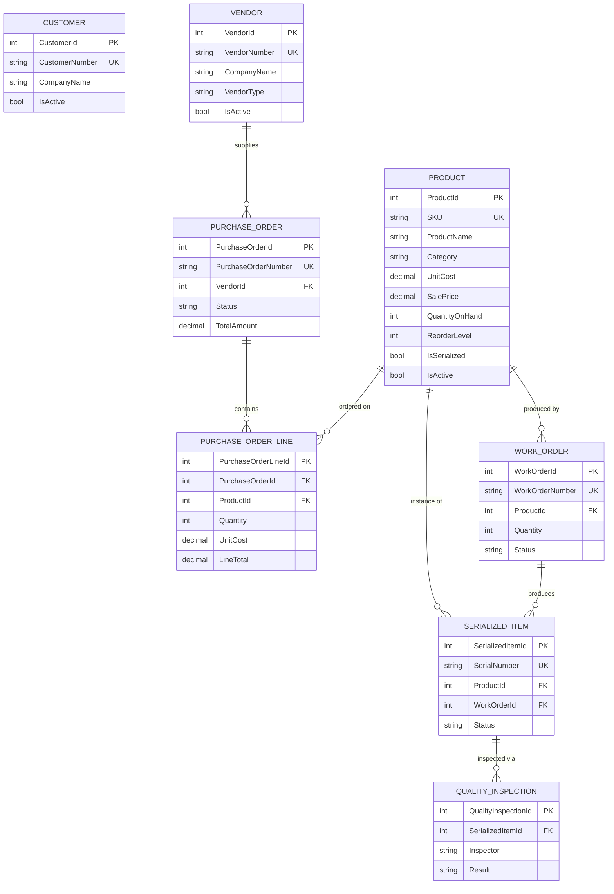

# Database

SQL Server (LocalDB for development), managed entirely through EF Core migrations — see `src/DartERP.Infrastructure/Data/Migrations`. Table and column shape comes from Fluent API configuration in `src/DartERP.Infrastructure/Configurations/*Configuration.cs`, one file per entity.

## Entity relationship diagram



`Customer` has no foreign key relationships in the current schema — Sales Orders, which would link a customer to an order, were cut from this build (see the README's Future Improvements).

## Tables

| Table | Notes |
|---|---|
| `Customers` | Unique index on `CustomerNumber`. Soft-deactivated via `IsActive`, never hard-deleted. |
| `Vendors` | Unique index on `VendorNumber`. `VendorType` stored as its enum name (`HasConversion<string>()`) so the raw table is readable in SSMS. Soft-deactivated via `IsActive`. |
| `Products` | Unique index on `SKU`. `Category` stored as its enum name. `UnitCost`/`SalePrice` are `decimal(18,2)`. |
| `PurchaseOrders` | Unique index on `PurchaseOrderNumber`. `Status` stored as its enum name. `VendorId` FK is `Restrict` on delete (vendors are soft-deleted, never hard-deleted, so this is a belt-and-suspenders guard). |
| `PurchaseOrderLines` | FK to `PurchaseOrders` is `Cascade` — lines are owned entirely by their parent order. FK to `Products` is `Restrict`. |
| `WorkOrders` | Unique index on `WorkOrderNumber`. FK to `Products` is `Restrict`. |
| `SerializedItems` | Unique index on `SerialNumber`, enforced at both the database (unique index) and application layer (`ISerializedItemRepository.SerialNumberExistsAsync`, checked before insert). FKs to `Products` and `WorkOrders` are `Restrict`. |
| `QualityInspections` | FK to `SerializedItems` is `Cascade` — inspections are owned by the item they're inspecting. |

## Why `Restrict` almost everywhere, `Cascade` only for true parent/child pairs

`PurchaseOrder → PurchaseOrderLine` and `SerializedItem → QualityInspection` are the only two relationships where the child genuinely has no independent existence — a line isn't meaningful without its order, an inspection isn't meaningful without the item it inspected. Everywhere else (`Vendor → PurchaseOrder`, `Product → WorkOrder`, etc.) uses `Restrict`, because those parent records are soft-deleted rather than removed, so an accidental cascade delete should never be possible in practice — but `Restrict` makes that a guarantee enforced by the database, not just a convention.

## Migrations

```bash
dotnet ef migrations add <Name> --project src/DartERP.Infrastructure/DartERP.Infrastructure.csproj --startup-project src/DartERP.Infrastructure/DartERP.Infrastructure.csproj --output-dir Data/Migrations
dotnet ef database update --project src/DartERP.Infrastructure/DartERP.Infrastructure.csproj --startup-project src/DartERP.Infrastructure/DartERP.Infrastructure.csproj
```

`DartErpDbContextFactory` (`IDesignTimeDbContextFactory<DartErpDbContext>`) lets the `dotnet ef` CLI construct the context at design time without needing the WinForms host's DI container — it points at the same LocalDB connection string as `appsettings.json`.

## Seed data

`DartERP.Infrastructure.Seed.DbSeeder` runs once at application startup (idempotent — it no-ops if `Customers` already has rows) and inserts realistic fictional data: 6 customers, 6 vendors (one inactive, to demonstrate active-only filtering), 9 products across raw material/component/packaging/finished-product categories, 7 purchase orders spanning every status, 6 work orders, 28 serialized items, and 28 quality inspections — enough that every screen, including the dashboard, is populated on first launch.
